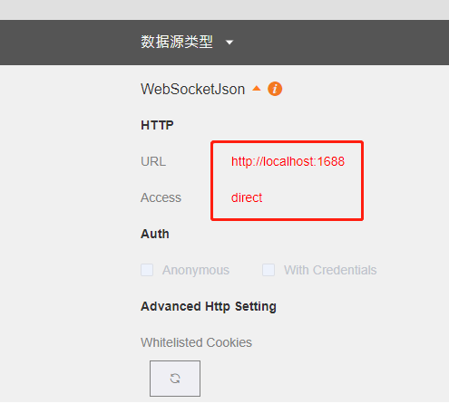

# SaaS Composer data source plugin use WebSocket  

1. Import SaaS Composer Datasource plugin with file **ws-plugin.zip**  
2. Use command `npm install` to install all node modules.  
3. Call `npm run serv` to start datasource server.  

  

- **URL** is database url.  
- **Access** use `direct`.  

# websocket server  

In websocket server, 
- Create route `/` : for check alive.   
- Create route `/search` : for select and search data tags.   
- In socket event`on message`: We periodically push data through WebSocket and return it to the getValue interface.  

# Sc plugin  

- In `getValue` interface, we new websocket object and check the object exist.  
- Set reconnect went socket close or error.  

# Note  

In Dockerfile Folder create Docker Image。

    docker build . -t <your username>/websocket-datasource

Docker Images

    $ docker images

    # Example
    REPOSITORY                      TAG        ID              CREATED
    node                            12         1934b0b038d1    5 days ago
    <your username>/websocket-datasource    latest     d64d3505b0d2    1 minute ago

Docker RUN:   

    docker run -p 49161:1688 -d <your username>/websocket-datasource

    